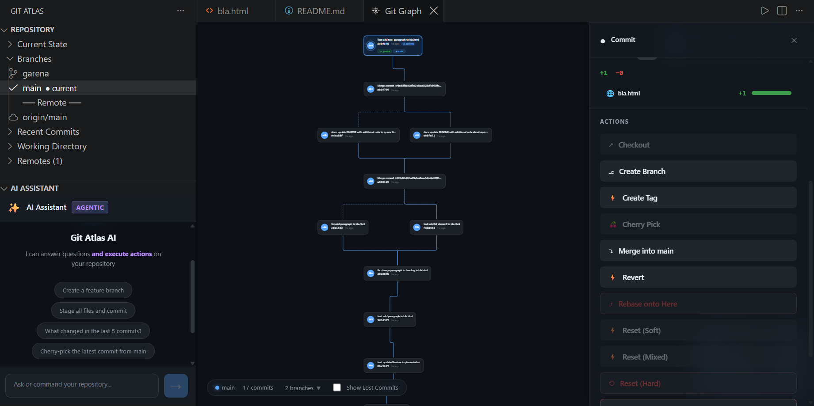
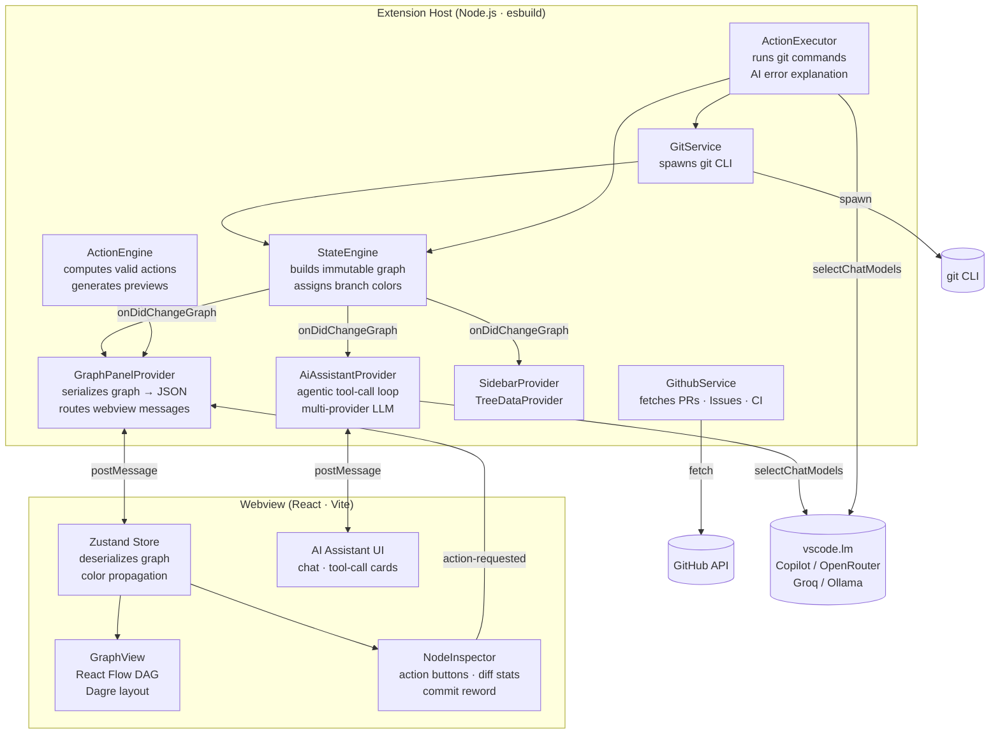

   

   &nbsp;&nbsp;&nbsp;&nbsp;
   <picture>
      <source media="(prefers-color-scheme: dark)" srcset="./resources/name-banner.svg">
      <source media="(prefers-color-scheme: light)" srcset="./resources/name-banner.svg">
      
   </picture>
   

  
<strong>Tired of git commands? Don't know which command to use? Scared what a command might do?</strong>

  
<strong>Instead, transform Git into an interactive visual graph and explore your repository</strong>

  
  

---

Git Atlas is a VS Code extension that replaces the mental overhead of Git with a beautiful, interactive visual graph. Understand Git through visualization rather than memorizing commands — treating your repository as a navigable state machine.

## Philosophy

- **Where am I?** Instantly see your `HEAD`, current branch, and repository state.
- **What can I do from here?** View valid Git actions based on your current node context.
- **What will happen if I do it?** Preview changes before executing them with dynamic visual highlighting.

The UI makes Git feel like navigating a flowchart instead of wrestling with a terminal.

---

## Features

- **Interactive Graph Webview** — A React Flow-based visual Directed Acyclic Graph (DAG) of your commit history with branch-colored edges and smooth animations.

- **Working Directory Node** — Uncommitted changes (staged, modified, untracked) appear directly in the graph above HEAD. Commit (`git add -A && git commit -m`) or stash (`git stash push`) from the node with interactive prompts.

- **Node Inspector & Commit Rewording** — Click any commit to view full details, diff statistics, and context-aware Git actions. Edit any commit message with the ✏️ button — automatically using `git commit --amend` for HEAD or interactive rebase for older commits.

- **Branch Color Legend** — Click the branch counter (`N branches ▼`) to reveal a popover of all branches and their unique colors. Uses a Golden Ratio HSL algorithm to guarantee no two branches share the same color. Newly created branches always inherit the correct color scope; ancestors of a new branch remain colored by their originating branch.

- **Action Previews** — Before executing any action, a centered modal previews what will happen, with plain-English explanations and clear danger warnings for destructive operations.

- **Git Action Execution** — Checkout, Branch, Commit, Stash, Merge, Rebase, Cherry-Pick, Reset (hard), Reword, Delete Commit, Push (with force / force-with-lease dropdown), Tag.

- **AI-Powered Error Explanation** — When any Git action fails, the extension immediately asks an available language model (GitHub Copilot or any configured provider) to explain *why* it failed and what the user should do. The plain-English explanation appears directly in the VS Code notification, with all raw details logged to the output channel.

- **AI Assistant (Sidebar)** — An agentic Git co-pilot. Ask questions, get repo-aware answers, and instruct it to perform multi-step Git operations. The assistant asks for branch names before creating branches, pauses for user approval on every write action, and supports VS Code LM API (Copilot), OpenRouter, Groq, Nvidia, Ollama, and custom OpenAI-compatible endpoints.

- **GitHub Integration** — Detects your remote and fetches Pull Requests, Issues, and CI/CD Action statuses. See CI badges and PR links directly on commits and in the sidebar.

- **Time-Travel (Reflog)** — Visually recover lost commits using `--reflog` visualization. Orphaned commits are distinctly styled.

- **Auto-Refresh** — Watches the `.git` folder for changes and automatically rebuilds the graph when external Git actions are performed.

- **Repository Sidebar** — Organized tree view of current state, branches, recent commits, working directory, stashes, tags, and remotes.

- **Premium Design** — Glassmorphic panels, framer-motion animations, dynamic edge highlighting, and full VS Code theme integration (Dark, Light, High Contrast).

---

## Installation

> This extension is currently in development. To run it locally:

1. Clone the repository.
2. Open the `gitvis` folder in VS Code.
3. Run `npm install` in the root directory.
4. Run `cd webview && npm install` to install webview dependencies.
5. Press `F5` to launch the Extension Development Host.
6. Open a Git repository in the new VS Code window to see the extension in action!

---

## Architecture

Git Atlas has two decoupled runtimes that communicate over VS Code's message-passing bridge.

### Design Principles

| | |
|---|---|
| **Immutable snapshots** | `StateEngine` produces a new `RepositoryGraph` on every rebuild — never mutates in place |
| **Layered architecture** | `GitService` → `StateEngine` → `ActionExecutor` → `Providers` → Webview |
| **Secure sandboxing** | Webview has zero Node.js access; all git I/O runs in the Extension Host |
| **Reactive UI** | `onDidChangeGraph` drives all refreshes — the webview never polls |
| **AI as enhancement** | Error explanation and the AI assistant degrade gracefully when no LM is available |

---

## 🤝 Contributing

Contributions are welcome! Please open an issue or submit a pull request if you'd like to help make Git Atlas even better.
