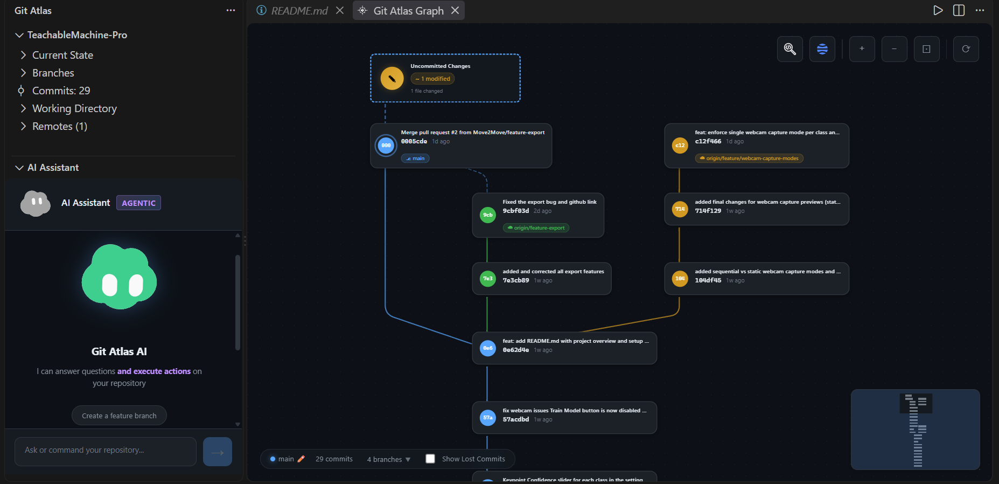
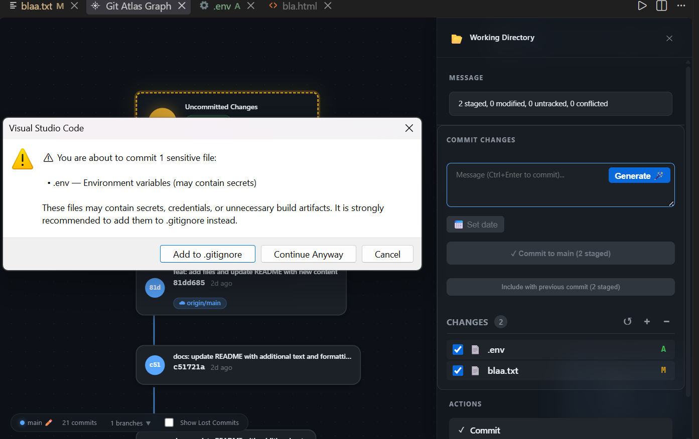
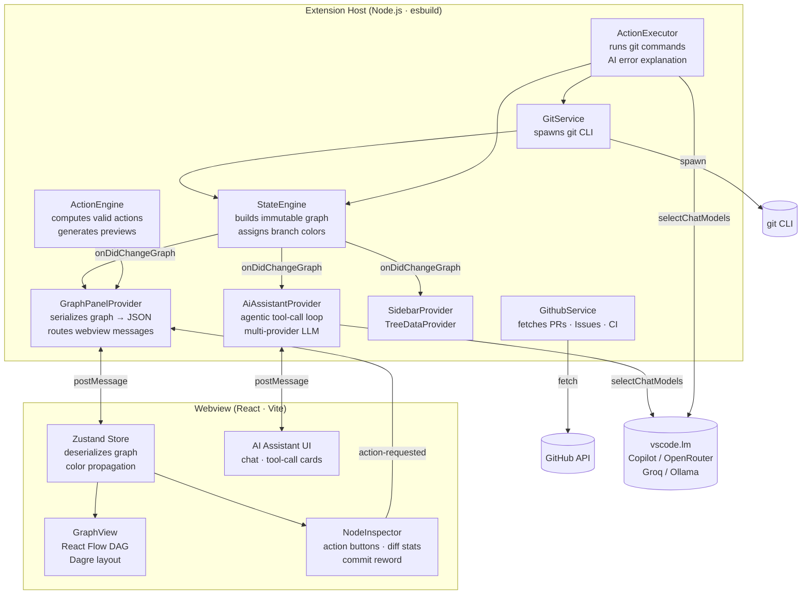

  

   
  

  <h1>Git Atlas</h1>

  
<strong>Transform Git into an interactive visual graph and explore your repository.</strong>

  
  

---

**Git Atlas** replaces the mental overhead of Git with a beautiful, interactive visual graph directly inside VS Code. Understand Git through visualization rather than memorizing commands — treating your repository as a navigable state machine.

  

## Why Git Atlas?

- **Where am I?** Instantly see your `HEAD`, current branch, and repository state.
- **What can I do from here?** View valid Git actions based on your current node context.
- **What will happen if I do it?** Preview changes before executing them with dynamic visual highlighting.

The UI makes Git feel like navigating a flowchart instead of wrestling with a terminal.

---

## Key Features

> ### Interactive Graph & Commit Panel
Visualize your entire commit history as a Directed Acyclic Graph (DAG). View uncommitted changes in the Working Directory node, and easily commit, amend, or stash files using the dedicated commit panel.

  <video autoplay loop muted playsinline src="https://github.com/user-attachments/assets/99dd27d3-b7c3-4255-bbbc-e082e3a0938b" width="100%"></video>

>  ### AI-Powered Git Agent
Ask questions, get repository-aware answers, and instruct the built-in AI agent to perform multi-step Git operations. It supports GitHub Copilot and open-source models!

  <video autoplay loop muted playsinline src="https://github.com/user-attachments/assets/2fbb6c17-83c3-4186-85d6-a65df9d44437" width="100%"></video>

> ### Backdating Commits
Need to backdate a commit? Easily set a custom commit date right from the commit panel. The date picker automatically constrains your choices so you can't pick a date older than the previous commit or in the future!

  <video autoplay loop muted playsinline src="https://github.com/user-attachments/assets/d3447fa8-1e01-4562-b179-d88914a81601" width="100%"></video>

> ### Editing Commit Messages
Click any commit to edit its message. Git Atlas automatically handles `git commit --amend` for HEAD and guides you through rewriting history.

  <video autoplay loop muted playsinline src="https://github.com/user-attachments/assets/c4dd79e4-5c27-44a9-8cab-3452a277652e" width="100%"></video>

> ### Purging Sensitive Files
Accidentally committed an `.env` file? Search for a file across your entire history and permanently purge it from all commits with a single click.

  <video autoplay loop muted playsinline src="https://github.com/user-attachments/assets/c6a655d6-0343-4086-9b09-af3778d86079" width="100%"></video>

> ### Sensitive File Detection
Warns you if you are about to commit sensitive files (e.g., credentials, build caches) and offers a one-click option to add them to `.gitignore` and unstage them before committing.

  

---

## Additional Features

- **Action Previews** — Before executing any action, a centered modal previews what will happen, with clear danger warnings for destructive operations.
- **GitHub Integration** — Detects your remote and fetches Pull Requests, Issues, and CI/CD Action statuses. See CI badges and PR links directly on commits.
- **Time-Travel (Reflog)** — Visually recover lost commits using `--reflog` visualization. Orphaned commits are distinctly styled.
- **AI Error Explanation** — When any Git action fails, the extension immediately asks an available language model to explain *why* it failed and what you should do.

---

## Architecture

Git Atlas has two decoupled runtimes that communicate over VS Code's message-passing bridge.

### Design Principles

| | |
|---|---|
| **Immutable snapshots** | `StateEngine` produces a new `RepositoryGraph` on every rebuild — never mutates in place |
| **Layered architecture** | `GitService` → `StateEngine` → `ActionExecutor` → `Providers` → Webview |
| **Secure sandboxing** | Webview has zero Node.js access; all git I/O runs in the Extension Host |
| **Reactive UI** | `onDidChangeGraph` drives all refreshes — the webview never polls |
| **AI as enhancement** | Error explanation and the AI assistant degrade gracefully when no LM is available |

---

## Contributing

Contributions are welcome! Please open an issue or submit a pull request if you'd like to help make Git Atlas even better.
