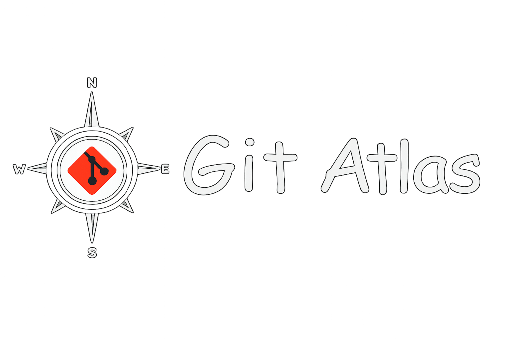

  
  
  
<strong>Transform Git into an interactive visual graph and explore your repository like a map.</strong>

  
  

---

Git Atlas is a VS Code extension that replaces the mental overhead of Git with a beautiful, interactive visual graph. Understand Git through visualization rather than memorizing commands, treating Git as a visual state machine.

## 🧭 Philosophy

- **Where am I?** Instantly see your `HEAD`, current branch, and repository state.
- **What can I do from here?** View valid Git actions based on your current node context.
- **What will happen if I do it?** Preview changes before executing them with dynamic visual highlighting.

The UI makes Git feel like navigating a flowchart instead of wrestling with a terminal.

## ✨ Features

- 🗺️ **Interactive Graph Webview:** A React Flow-based visual Directed Acyclic Graph (DAG) of your commit history.
- 🔍 **Node Inspector & Action Previews:** Click any commit to see a premium slide-out panel with full details, diff statistics, and context-aware valid Git actions.
- 🛡️ **Visual Previews:** Before executing any dangerous action, the graph visually previews what will happen (e.g., highlighting commits that will be dropped during a hard reset).
- ⚡ **Git Action Execution:** Execute operations (Checkout, Branch, Merge, Rebase, Cherry-Pick, Reset) directly from the graph with native VS Code confirmation dialogs.
- 🚑 **Robust Error Handling:** Intercepts common Git errors (Merge Conflicts, Dirty Working Tree) and converts them into user-friendly explanations with suggested next steps.
- 🗂️ **Repository Sidebar:** An organized tree view showing your current state, branches, recent commits, working directory, stashes, tags, and remotes.
- 🐙 **GitHub Integration:** Automatically detects your remote and fetches Pull Requests, Issues, and CI/CD Action statuses. See CI badges and PR links directly on commits and in the sidebar.
- 🤖 **AI Assistant:** An intelligent Git co-pilot in the sidebar. Ask questions about your repository state, get explanations of Git concepts, and receive suggested fixes for errors. Supports VS Code Language Models (GitHub Copilot) and custom OpenAI API keys.
- ⏳ **Time-Travel (Reflog):** Visually recover lost commits using the built-in `--reflog` visualization. Orphaned commits are dynamically styled to indicate their "lost" status.
- 🔄 **Auto-Refresh:** Automatically updates the graph and sidebar when you perform Git actions externally by actively watching the `.git` folder.
- 🎨 **Premium Design:** Glassmorphic elements, smooth animations, dynamic edge highlighting for valid actions, and full VS Code theme integration (Dark, Light, High Contrast).

## 🚀 Installation

This extension is currently in development. To run it locally:

1. Clone the repository.
2. Open the `gitvis` folder in VS Code.
3. Run `npm install` in the root directory.
4. Run `cd webview && npm install` to install webview dependencies.
5. Press `F5` to launch the Extension Development Host.
6. Open a Git repository in the newly opened VS Code window to see the extension in action!

## 🏗️ Development Architecture

The extension consists of two robustly decoupled parts:

1. **Extension Host (Node.js):**
   - Manages Git CLI communication (`GitService`).
   - Reconstructs the Git state graph (`StateEngine`).
   - Manages VS Code providers (`SidebarProvider`, `GraphPanelProvider`, `AiAssistantProvider`).
   - Bundled securely using `esbuild`.

2. **Webview (React / Vite):**
   - A sandboxed React application.
   - Uses `React Flow` for rendering the interactive DAG.
   - `dagre` for directed graph layout.
   - `zustand` for state management and `framer-motion` for animations.
   - Built securely via `vite`.

## 🤝 Contributing

Contributions are welcome! Please open an issue or submit a pull request if you'd like to help make Git Atlas even better.

## 📄 License

MIT License
